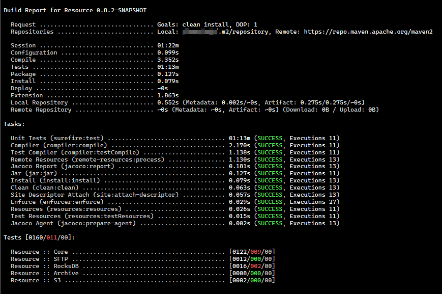

# Maven

Utilities, plugins and extensions for Java projects using Maven.

## Plugins

### Containers

While there are several alternatives available for Java projects, one of the most well-known options is the one developed by Google. However, I needed a simpler setup.

The plugin still utilizes Docker for building, but this is not an issue for most users. It eliminates the need for custom Docker build commands and includes a library that manages the application startup (setting up the classpath and other JVM arguments).

The only required parameter to package a Java application into a container image is as follows:

* `image`: The name of the image (the tag is generated from the application version)
* `repository`: the name of the repository (if hostname is not provided, it is presumed `docker.io`); a <server></server> with an id equal to the contained of the repository tag.
* `mainClass`: The application class (which runs the application)

The parameters are declared as with any Maven plugins, in the <build></build> section of your POM. 

```xml
<plugin>
    <groupId>net.microfalx.maven</groupId>
    <artifactId>maven-plugin</artifactId>
    <version>0.8.1</version>
    <executions>
        <execution>
            <id>container</id>
            <goals>
                <goal>package</goal>
            </goals>
            <configuration>
                <image></image>
                <repository></repository>
                <mainClass></mainClass>
            </configuration>
        </execution>
    </executions>
</plugin>
```

## Extension

I have used Maven as my build tool for over 15 years. While it is not perfect, it performs remarkably well for projects ranging from small to highly complex. However, there are a few aspects I wish were different, many of which have been echoed by other developers over the years in the issues they’ve logged.

### Logging  
Maven's verbose logging style does a good job of informing users about what is being done, but it can be overwhelming when details are not needed. There isn't much of an option between the verbose output and what I call _quiet mode_, which shows virtually nothing.

### Performance  
In addition to reducing unnecessary logging, developers need to identify which parts of the build are slower or problematic. A report at the end of the build should indicate the total time spent on plugins (which handle most of the work), repository access, and any other activities that could take significant time.

### Reporting  
A concise summary report in the console should display where time is being utilized and the results of any tests that were run. Additionally, a detailed HTML report should be generated, providing more in-depth information about each part of the build, which can also be displayed in the CI tool for each build.

Gradle addresses most of these concerns, but I have never been able to fully embrace that build tool.

Ultimately, I decided to stick with Maven, make improvements, and contribute back to the community. This extension aims to provide the functionalities I need and hopefully will be useful to others as well.

### Use It

In order to use it, the extension needs to be registered using Maven's extension support. Register the following XML (or append to your current file if other extensions are used) in .mvn/extensions.xml (replace the version as needed):

```xml
<extensions>
    <extension>
        <groupId>net.microfalx.maven</groupId>
        <artifactId>maven-extension</artifactId>
        <version>0.8.1</version>
    </extension>
</extensions>
```

Once the registration is complete, the behavior of subsequent executions of any Maven goal will change.

First, you will notice a decrease in logging. There will be a brief description of what is being built, along with the main build parameters such as profiles and goals. Each module will be summarized in a single line. The main Mojos will be logged with brief keywords, while any additional Mojo will be represented by a single dot (`.`).

Second, after the build concludes, a summary report will be logged. This report will provide every developer with the important information they need.



Third, an HTML report will be generated, which will be mentioned at the end of the summary report. This report can be opened for detailed inspection and can also be integrated with CI tools as needed.

TODO: work in progress

The behaviour of the extension can be changed with a few parameters:

* `microfalx.extension.enabled=false` Disables the extension without the need to be removed from extensions.xml (might be useful if the extension misbehaves)
* `microfalx.quiet=false` The default build behaviour can be reverted (verbose logging), while preserving the build report at the end
* `microfals.progress=false` The progress is disabled, and the build is fully quiet; The only thing displayed on the screen (console) would be the report at the end


